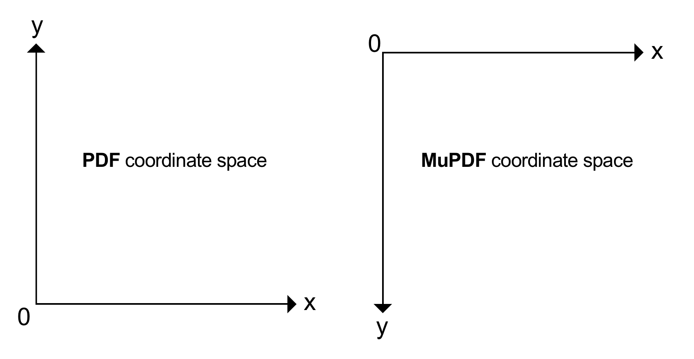

.. _How_To_Guide_Coordinate_System:

The **MuPDF** Coordinate System
=================================

Origin Point, Point Size and Y-Axis
----------------------------------------------

In **PDF**, the origin `(0, 0)` of a page is located at its **bottom-left point**. In **MuPDF**, the origin `(0, 0)` of a page is located at its **top-left point**.

Point Size
~~~~~~~~~~~~~

Coordinates are float numbers and measured in **points**, where:

- **one point equals 1/72 inches**.

Positioning objects
~~~~~~~~~~~~~~~~~~~~~~~~~~

When working with positioning objects, we should appreciate this coordinate system.

For example:

.. code-block:: javascript

    let rectangle = [0,0,200,200]

Results in:

.. _How_To_Guide_Coordinate_System_PDF:

Coordinate space and `PDFObject`
~~~~~~~~~~~~~~~~~~~~~~~~~~~~~~~~~~~~~~~~~~~~~~~~~~~~

In exception to using the **MuPDF** coordinate space, if we are dealing *directly* with `PDFObject` streams then we are using the **PDF** coordinate space.

Therefore if we doing something low-level like adding a content stream to a `PDFObject`, for example:

.. code-block:: javascript

    var extra_contents = document.addStream("q 200 0 0 200 10 10 cm /Image1 Do Q", null)

Then in this case we are working in the **PDF** coordinate space with the origin Y-axis at the bottom left.

.. note::

    To explain the syntax behind `"q 200 0 0 200 10 10 cm /Image1 Do Q"` this is **Adobe PDF** syntax for referencing, sizing and positioning an image and can be explained as follows:

    .. code-block:: bash

        q                               % Save graphics state
            200 0 0 200 10 10 cm        % Translate
            /Image1 Do                  % Paintimage
        Q                               % Restore graphics state

    For more see `page 337 of the Adobe PDF Reference Guide <https://opensource.adobe.com/dc-acrobat-sdk-docs/pdfstandards/pdfreference1.7old.pdf>`_.

